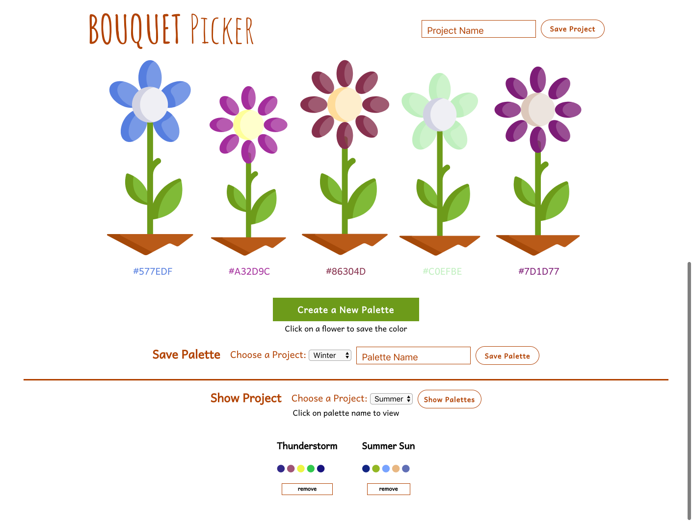
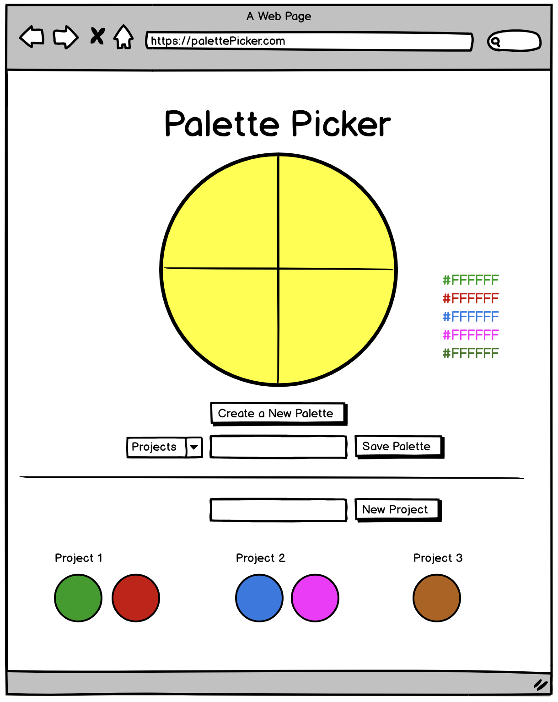

# Bouquet Picker

### Background/About

Bouquet Picker is a palette picker for a flower bouquet. A user can generate random colors on the flowers. Flower colrs can be saved by clicking on a flower. Projects can be saved and inside a project, a user can save multiple palettes. A user can view their saved palettes for any specific project. By selecting a saved palette, they can view the colors on the flowers.

This project has a postgres database for storing project and palette information. The server is built with Express.js, while the front end was build with jQuery.

### See it Live

[Bouquet Picker](perfect-palette.herokuapp.com) on Heroku


### Primary JavaScript Technologies Used

* jQuery
* Express.js
* Knex.js

### Screenshots

#### Bouquet Picker:



#### Wireframe:




<!-- ### Setup
#### Frontend

Clone the repo

Run ```npm install``` from the root directory

Run ```npm start``` and visit localhost:3000 in your browser

#### Backend -->


### Original Assignment

[Palette Picker](http://frontend.turing.io/projects/palette-picker.html) from the Turing School of Software & Design

### Contributors

* Tobin Nelson: [Github Profile](https://github.com/Tobin-jn)
